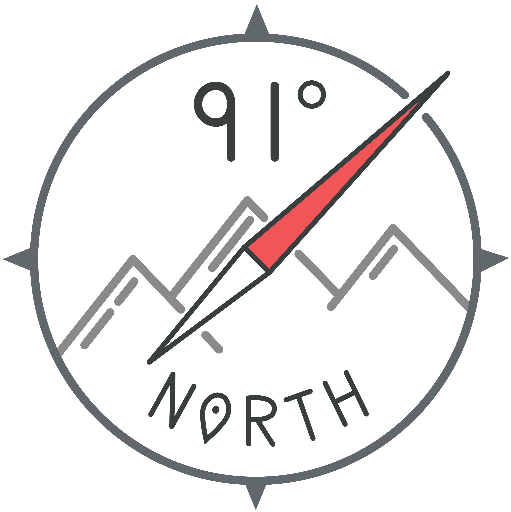

Hey, I'm **Ben Thornton**!

I'm a builder of things. I love building communities through organizing [HackFSU](http://hackfsu.com), [Florida Hackers](http://floridahackers.com), and studying Urban Planning. Helping people reach their full potential and creating tools for them to thrive is my passion.

Currently I am a Senior at **Florida State University** in Tallahassee, FL studying Geography, Urban Planning, and Entrepreneurship. I am working at the [Florida Geographic Alliance](http://fga.freac.fsu.edu) as a Web Master and GIS Education Developer. I also work with the [Florida Resources and Environmental Analysis Center](http://freac.fsu.edu) as a cartographer, GIS analyst, and researcher on topics of Bivariate Mapping and Walkability.

On the weekends I travel to hackathons with **[Technole](http://technole.org)** and [Florida Hackers](http://floridahackers.com). At night, you can probably find me working at [Domi Station](http;//domistation.com).

I spend most of my time on Front-End development, [ArcPy](http://pro.arcgis.com/en/pro-app/arcpy/main/arcgis-pro-arcpy-reference.htm), and working in Illustrator with loads of vectors.

Currently trying to improve with these technologies:

* Javascript
* [Mapbox](http://mapbox.com) Libraries
* Node.js

### Let's get in touch and build things together!

* Twitter: [91degn](http://www.twitter.com/91degn)
* Instagram: [91degreesnorth](http://www.instagram.com/91degreesnorth)
* Github: [geofsu](http://www.github.com/geofsu)
* LinkedIn: [benjaminwthornton](https://www.linkedin.com/in/benjaminwthornton)
